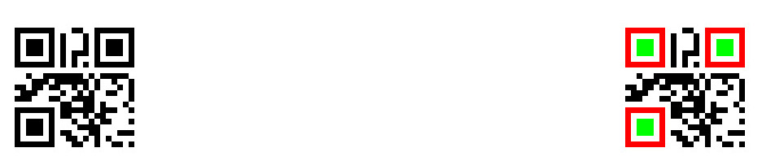

This program recognizes the QR code from jpg file.

The raw image does not have a size or offset of squares (the three of featured squares on the vertecies).
So, this program recognizes where the squares of QR code exist, and we can calculate the size of QR code.

In this program, I focused on converting QR raw pixel data from jpg, rather than QR data format itself.

Ideally, it should be retrieved from camera, but I had a little time and technical difficulty.

